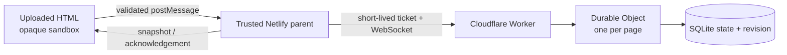
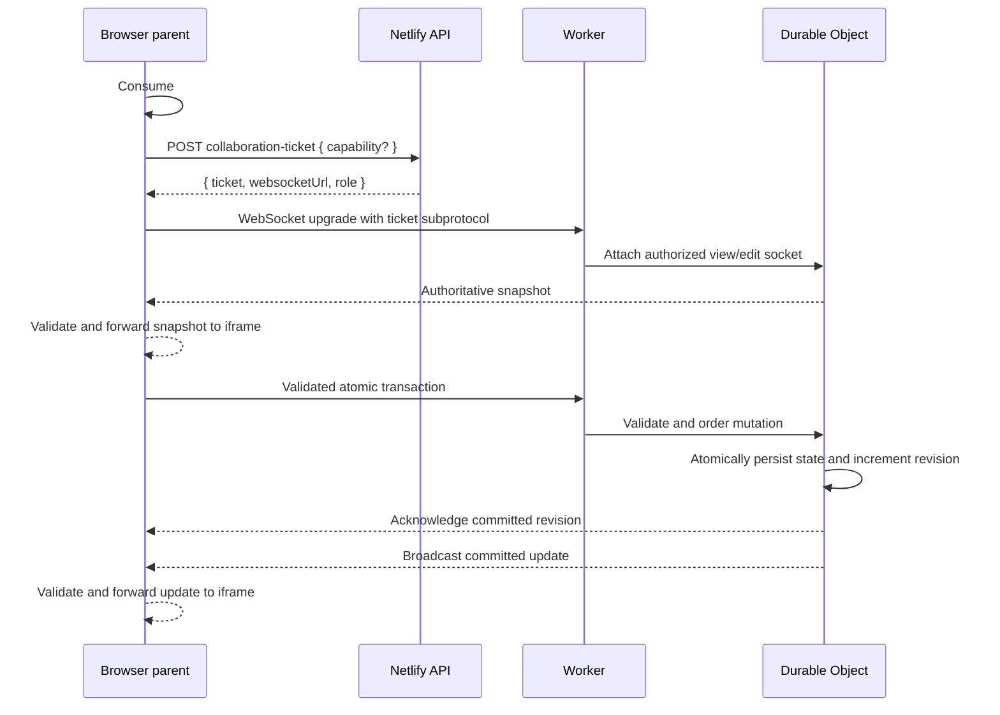
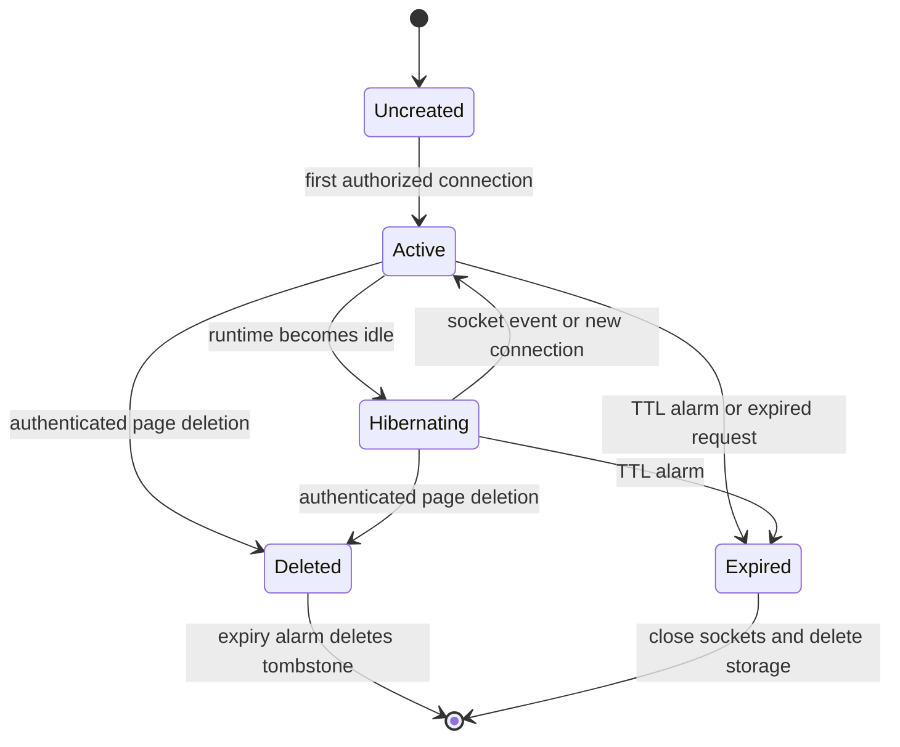
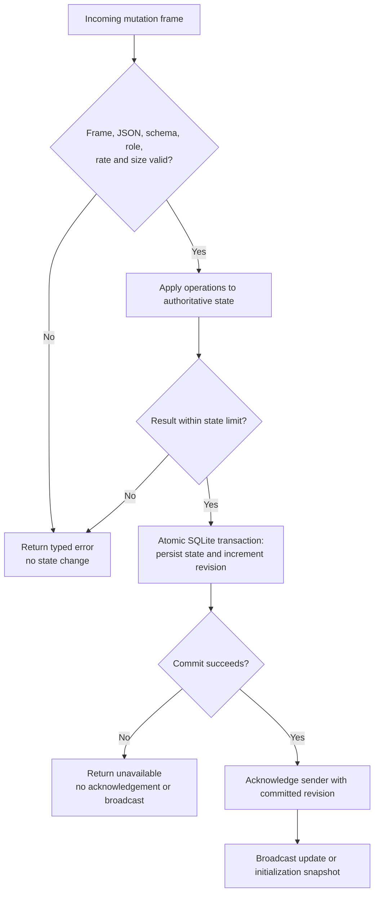

# Collaboration

Collaboration is an opt-in shared JSON document for small, temporary tools such as boards, polls,
and planning pages. Netlify remains the public application and page store. A Cloudflare Worker
authorizes WebSockets and routes each page to one SQLite-backed Durable Object.

## Security architecture

Uploaded HTML remains an opaque-origin iframe with `sandbox="allow-scripts"` and the existing
uploaded-page CSP. It cannot use `fetch`, XHR, EventSource, or WebSocket. The injected SDK only
exchanges versioned messages with the trusted parent; the parent validates the iframe source and
payload before forwarding an operation.



The viewer URL `/p/{pageId}` can only observe state. The editor URL carries a random capability in
`#edit=...`. URL fragments are not sent in HTTP requests. The parent moves a valid capability into
page-scoped `sessionStorage`, removes the fragment with `history.replaceState`, and sends the
capability only to the same-origin ticket endpoint over HTTPS. Uploaded code never receives the
capability or ticket.



## Room lifecycle

Each collaborative page maps to one room. The first authorized connection creates its durable row
and expiry alarm. WebSocket hibernation suspends compute while retaining accepted sockets and SQLite
state; the next socket event wakes the same room. Expiry and authenticated page deletion are
terminal.



The page TTL caps ticket lifetime and is stored with the room. At expiry, the room closes all
sockets, deletes Durable Object storage, and rejects later connections with `410 Gone`. Admin page
deletion immediately clears shared state, records a deletion tombstone, and closes sockets; the TTL
alarm later removes the tombstone. The alarm also remains a fallback if the deletion notification
fails. Cleanup is idempotent.

## Page API

Collaboration-enabled uploads receive `window.ephemeralCollab` before page-authored scripts run:

```ts
type Snapshot = { state: JsonObject; revision: number };

type EphemeralCollab = {
  readonly ready: Promise<Snapshot>;
  readonly mode: "view" | "edit";
  initialize(initialState: JsonObject): Promise<Snapshot>;
  transact(operations: Operation[]): Promise<Snapshot>;
  subscribe(listener: (snapshot: Snapshot) => void): () => void;
};
```

`initialize` is create-if-empty. The first accepted initialization wins. `transact` accepts an
atomic non-empty array of `{ type: "set", path, value }` and `{ type: "delete", path }` operations.
Use stable IDs instead of array positions so concurrent edits to different records do not collide.

```js
const initial = { cards: {} };
let snapshot = await window.ephemeralCollab.ready;

if (Object.keys(snapshot.state).length === 0 && window.ephemeralCollab.mode === "edit") {
  snapshot = await window.ephemeralCollab.initialize(initial);
}

window.ephemeralCollab.subscribe((next) => render(next.state));

await window.ephemeralCollab.transact([
  { type: "set", path: ["cards", crypto.randomUUID()], value: { title: "Ship it" } },
]);
```

Mutations reject immediately while disconnected and are never queued offline. On reconnect, the
parent mints a fresh ticket and the server sends a complete authoritative snapshot. Pages should
show a retryable message and let the user repeat an action after reconnection.

The runnable fixture at `tests/fixtures/collaborative-kanban.html` demonstrates accessible card
creation and movement without any network API other than `window.ephemeralCollab`.

Collaborative uploaded pages use a stricter CSP than ordinary pages: only inline script/style and
`data:`/`blob:` media are permitted. External script, stylesheet, font, image, form, navigation, and
programmatic network destinations are all unavailable so shared state cannot be encoded into a CDN
resource URL. Collaboration state must still be treated as untrusted input and never contain
secrets.

## Browser/backend contract

- `POST /api/pages` accepts `collaboration: boolean`. A collaborative response retains `url` and
  adds `collaboration: { viewUrl, editUrl }`.
- `GET /api/pages/{id}` exposes only `collaboration: boolean`, never capability material.
- `POST /api/pages/{id}/collaboration-ticket` accepts `{ capability?: string }` and returns
  `{ ticket, websocketUrl, role: "view" | "edit" }`.
- The socket uses subprotocols `ephemeral-collaboration-v1` and the compact signed ticket. Tickets and
  capabilities must never be placed in query strings or logs.

## Screenshot capture

Collaborative page viewers can request a frozen full-page PNG. The trusted parent sends
`POST /api/pages/{pageId}/screenshots` with an empty JSON object; uploaded code cannot choose the
capture target or call the endpoint itself. A successful `201` response is:

```json
{
  "id": "screenshot-id",
  "pageId": "page-id",
  "createdAt": "2026-08-23T10:15:00.000Z",
  "expiresAt": "2026-08-23T22:15:00.000Z",
  "revision": 17,
  "sizeBytes": 42000,
  "url": "/api/pages/page-id/screenshots/screenshot-id"
}
```

Before presenting the download, the browser requires the response page ID to match and the URL to
be same-origin with the exact `/api/pages/{pageId}/screenshots/{id}` shape. It displays capture time
and authoritative revision, permits only one in-flight request, and exposes progress and results
through an ARIA live region. The action is absent from ordinary, non-collaborative pages.

A `410` announces that the page expired and permanently disables further capture. A `429` announces
the optional `Retry-After` delay, while `503` reports exhausted daily browser quota; both allow a
later retry. Other failures remain retryable. Failed requests never retain or expose a stale
download link.

## Limits and conflict behavior

Rooms accept at most 25 connections, 256 KiB of state, 16 KiB frames/transactions, 100 operations
per transaction, JSON depth 16, and path segments up to 128 characters. `__proto__`, `prototype`,
`constructor`, non-finite numbers, cycles, and malformed messages are rejected. Transactions are
ordered by the Durable Object. Different paths are preserved; the last accepted operation wins for
the same path.



Validation, reduction, persistence, and revision increment occur before acknowledgement or
broadcast. A rejected operation cannot partially mutate a room. Initialization broadcasts a full
snapshot; later transactions broadcast their operations and committed revision. If storage fails,
the sender receives `unavailable` and clients resynchronize from a full snapshot after reconnecting.
Oversized frames are rejected and closed; malformed, forbidden, rate-limited, and over-capacity
requests receive stable errors without mutation.

Browser mutations fail immediately when no socket is open and are never queued. A sent request that
does not receive an acknowledgement within ten seconds rejects locally; because its commit outcome
may be unknown, the page should wait for the next authoritative snapshot before the user retries.
Unexpected socket closure rejects pending requests, starts a reconnect loop with bounded exponential
delay and fresh tickets, and replaces local state with the server snapshot after reconnection.

## Configuration and operations

The app-shell CSP must add exactly the configured WebSocket origin to `connect-src`; the uploaded
page CSP must remain unchanged. Production requires:

- Netlify: collaboration ticket signing/verification material and the public collaboration Worker
  URL.
- Cloudflare: the corresponding ticket verification key, exact allowed Netlify origin, Durable
  Object binding, and SQLite migration.
- `netlify.toml`: `connect-src 'self' wss://<exact-worker-origin>` (no wildcard).

Use `ws://localhost` only in local development. Monitor active rooms, connections, rejected
messages, authentication failures, state size, cleanup, and quota exhaustion without logging page
state or credentials. Feature rollout should remain disabled until the two-editor/one-viewer E2E,
CSP, expiry, deletion, hibernation, and capacity tests pass.

Deploy the Worker first, run the Wrangler dry-run and health check, configure matching secrets and
origins in Netlify, then enable the upload switch. Keep the Worker on a hard-limited Free account for
the hobby deployment; quota exhaustion must return `503` rather than fall through to paid capacity.
Screenshot attempts also have a fixed 25/day global budget, 12 captures/96 MiB per page, and no paid
fallback. Rotate capability keys with the bounded previous-key window and rotate ticket/admin keys
by deploying both issuers/validators together.

To disable the feature, hide/reject new collaborative uploads first, retain read access until page
TTLs drain, and then remove the socket origin from the app CSP. To roll back a Worker version, deploy
the last known-good bundle without reverting SQLite migration tags; Durable Object schema changes
are forward-only. If authorization or isolation is suspect, disable ticket minting immediately,
close/delete affected rooms through the authenticated service route, and rotate ticket/admin keys.
